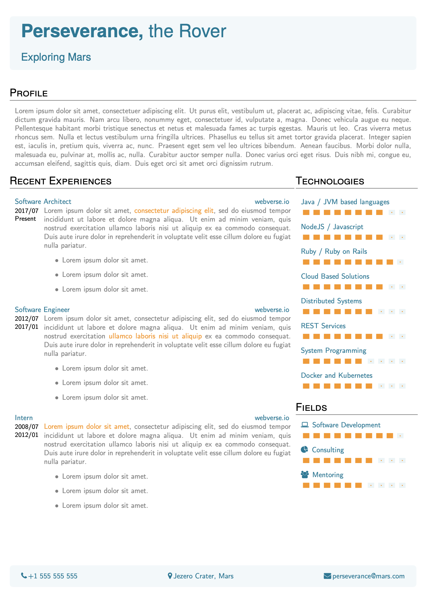

## One page Curriculum - Latex template

---

As time passes and you acquire experience, bigger is the difficult to keep your Curriculum up to date. Also past experiences from 20 years ago like - I wrote a payroll system using [DBase III Plus](https://en.wikipedia.org/wiki/DBase) - is not attractive anymore. Keep that glory with you!

Thus, the goal of this template is to remark only the most recent experiences. Keeping it simple and inside in only one page.

If your work experience sounds interesting to the job you're applying to, I am pretty sure that the company / recruiter will enter in contact anyway. So, at this point, you'll have the chance to tell them your whole professional history.

Any question, feel free to contact me.
